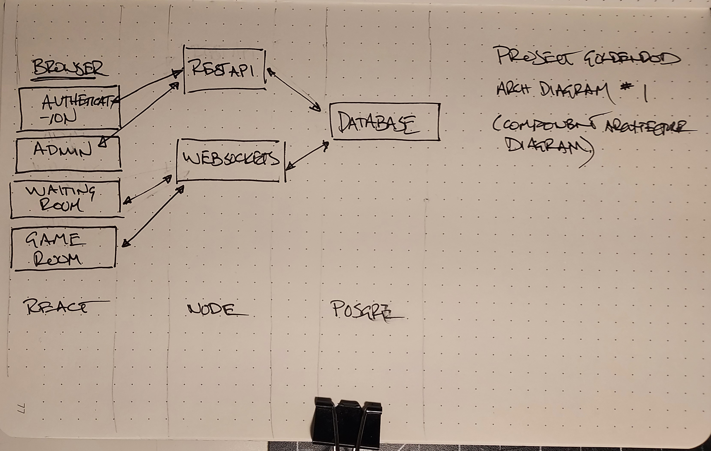

# project_goldenrod

A theater-of-the-mind VTT

## Architecture Diagram



## Initial Component Lib Plan

```
├── components
│   ├── Form
│   ├── Button
│   ├── Email Input
│   ├── Text Input
│   ├── Text Area
│   ├── Password  Input
│   ├── Table (Lobby / Waiting Room)
│   ├── GM Card
│   ├── PLayer Card
│   └── Toast
│   └── ...
└──
```

I know I'll need more components for Dice Roller and Handout Management. Will document those when the time comes.

## Initial State Plan

```
├── state
│   ├── Lobby
│   ├── Game
│   └── ...
└──
```

## Stack

### UI

React, React Router, Redux

### Server

Node, Express

### Database

PosgreSQL, Prisma

#### users

| field    | type                  |
| -------- | --------------------- |
| id       | int                   |
| email    | string                |
| userName | string                |
| password |                       |
| role     | admin \| gm \| player |

#### games

| field   | type |
| ------- | ---- |
| id      | int  |
| name    | text |
| summary | text |
|         |      |

#### messages

| field   | type |
| ------- | ---- |
| id      | int  |
| time    | text |
| room    | text |
| userId  |      |
| message |      |

#### jwt

probably need a table for this.
